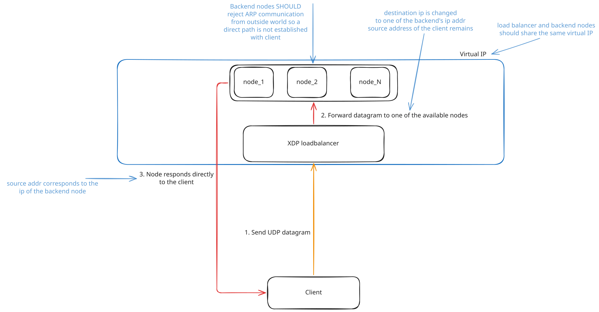
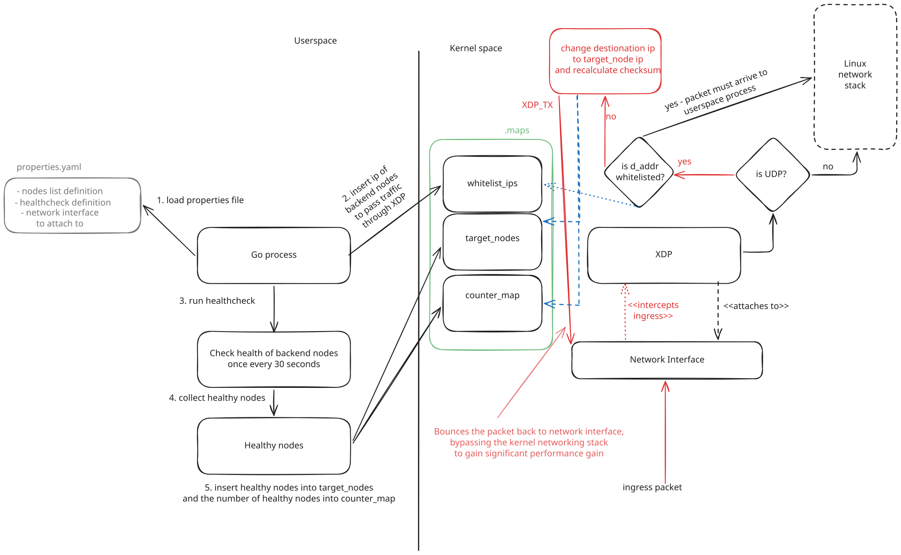

# Hana - eBPF powered load balancer
Hana is built on top of [ebpf](https://docs.ebpf.io/) and can be used as a load balancer for UDP communication. Just like [katran](https://github.com/facebookincubator/katran), Hana 
uses DSR (Direct Service Return) architecture and requires a bit of a configuration regarding virtual IP and ARP.  
 

 
